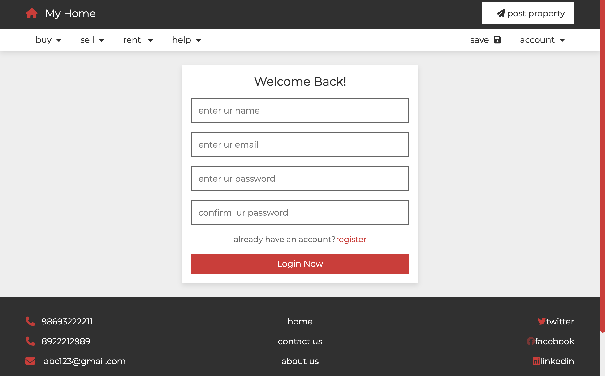
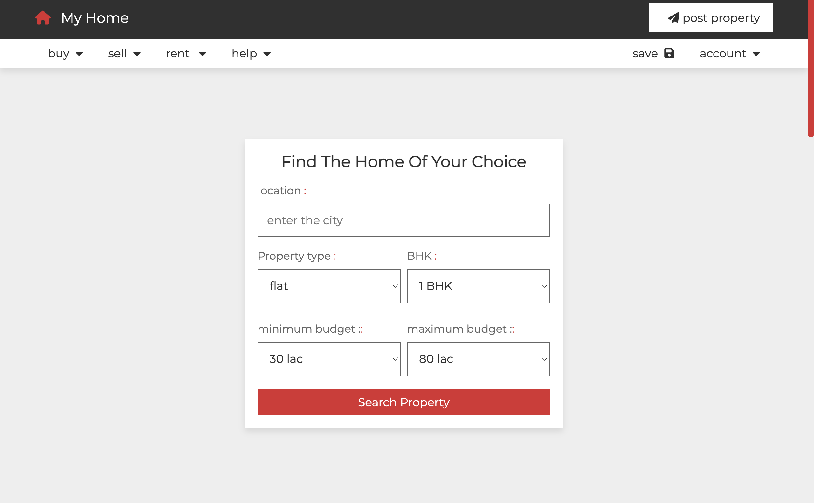
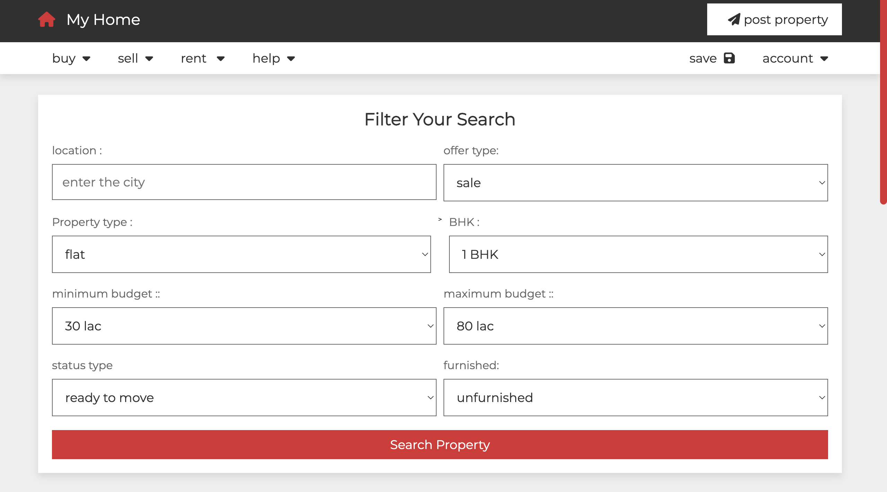
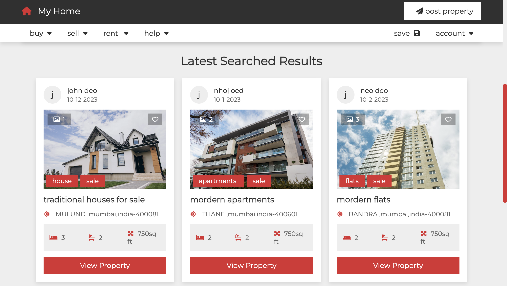
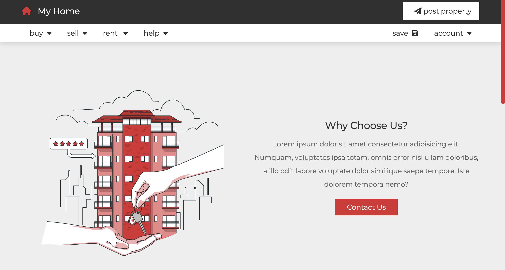
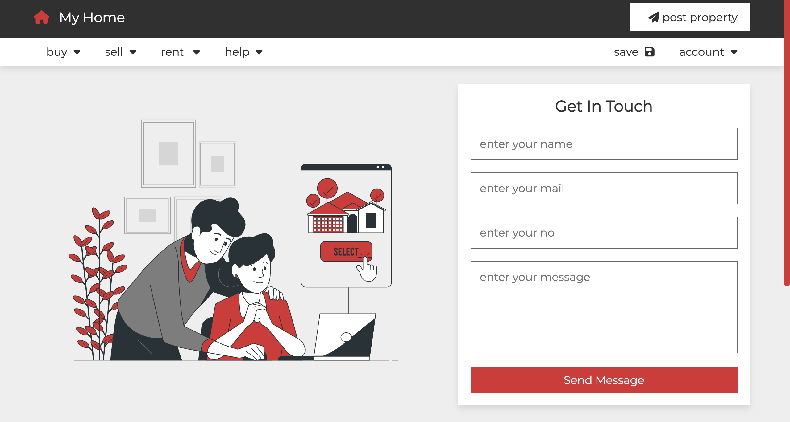
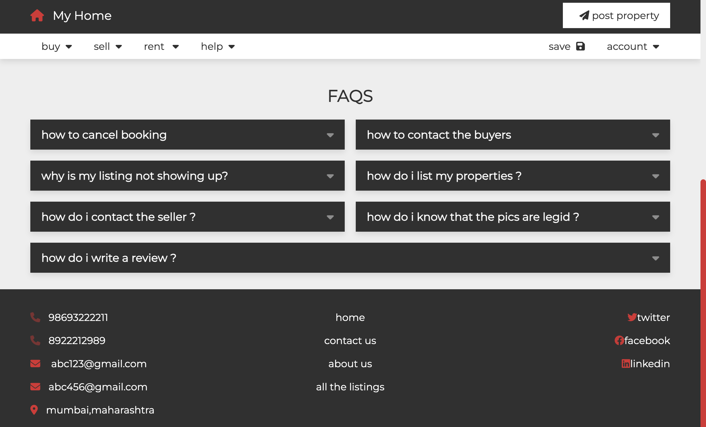

## DreamSpace

DreamSpace is a modern real estate website that helps users find their ideal properties with easy search filters. It includes features like property posting, saved listings, a user dashboard, client reviews, a contact page, and an FAQ section. DreamSpace makes browsing, managing, and choosing properties simple and hassle-free.

### App Preview









### Features

- **Property Listings**: Search and view properties for sale or rent.
- **Filter System:** Customizable search options based on property type, location, and budget.
- **Client Reviews:** User-generated reviews to help make informed decisions.
- **FAQ Section:** A dedicated area for frequently asked questions, aiding user navigation.

### Tech Stack

- **HTML, CSS, JavaScript:** For building the user interface.
- **PHP:** Backend logic and server-side handling.
- **PostgreSQL:** Database management for storing property listings and user data.
  
### Getting Started

1. **Clone the Repository:**
   ```bash
   git clone https://github.com/AnayaChoudhari/Real-estate-website.git
   ```

2. **Navigate to the Project Directory:**
   ```bash
   cd Real-estate-website
   ```

3. **Install PHP (if not already installed):**
   Windows:
   ```bash
   Download from https://windows.php.net/download
   ```
   Mac (Homebrew):
   ```bash
   brew install php
   ```
4. **Verify PHP Installation:**
   ```bash
   php -v
   ```   
5. **Start the Server:**
   ```bash
   php -S localhost:8000
   ```
6. **Access the Application:**
   - Open your browser and go to [http://localhost/Real-estate-website/home.php](http://localhost/Real-estate-website/home.php) to start using DreamSpace.

### Contributing

We welcome contributions to make DiagnosticHub even more feature-rich and accurate. Please fork the repository, make your changes, and submit a pull request.

### License

This project is licensed under the [MIT License](LICENSE).

### Acknowledgements

- Special thanks to the open-source community for the tools and libraries used in this project.
